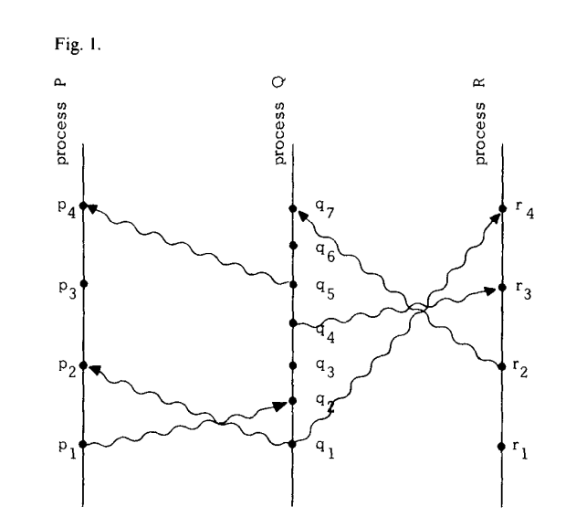

<table>
  <tr>
    <td width="150" align="center">
      
    </td>
    <td>
      <h1>Lamport's logical clock python implementation</h1>
      
<strong>André Martins</strong> 
      Bachelor Student – University of Luxembourg 
      <a href="mailto:0230991223@uni.lu">0230991223@uni.lu</a>  
      <a href="https://github.com/oliveira-andre-unilu">GitHub</a>
    </td>
  </tr>
</table>

---

## Main algorithm logic

The script consists on three main entities:

- **Class Task:** class defining each task.
- **Class Process:** class defining a process containing several tasks.
- **Class LogicalClockSystem:** class representing a system containing several parallel processes.

### Class Task

This class mainly consists on creating a new entity for tasks.
For more information about the class please visit the code documentation.

### Class Process

This class is responsible for storing and ordering a list of tasks.
It uses an array to store all the tasks while also keeping track of the order.

This class is also responsible for attributing the correct clock value for their respective tasks.

For more information about the class please visit the code documentation.

### Class LogicalClockSystem

This class is responsible for attributing the final execution order off the
respective "X" processes that it stores.

For more information about the class please visit the code documentation.

## How to test the implementation

An existing example taken from the course lecture has been used for testing this implementation.
In order to run the code simply type: `python Lamports_Logical_Clock.py` and the final execution order should be printed.

The chosen example is the following:

